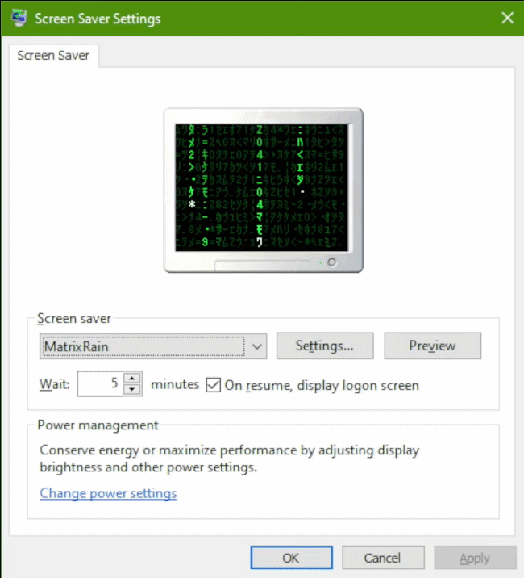

# MatrixRain

A Windows screensaver that draws a Matrix-style "digital rain" effect, with a
configurable character set, colour, density, and speed. Built on .NET 9 +
WinForms. No third-party packages.

<p align="center">
  
</p>

## Features

- Fullscreen on every monitor; integrates with the standard Windows screensaver
  flow (right-click `.scr` → Install, live preview thumbnail in *Screen Saver
  Settings*, idle-trigger via the "Wait" timer).
- Persistent character grid — every cell on screen is always filled with dim
  glyphs; rain streams "wipe" through columns and replace characters as they
  fall, instead of streams drifting over a black void.
- 10 character-set presets, each with its own font fallback chain:
  - **Arabic** (basic letters + Arabic-Indic digits + Persian/Urdu extensions)
  - **Chinese (Hanzi)** (CJK Unified Ideographs, ~20k chars)
  - **Cyrillic** (Russian + Ukrainian + Belarusian + Serbian, full block)
  - **Greek**
  - **Hebrew** (22 base consonants + 5 final letterforms)
  - **Japanese (Katakana)** — the canonical 32 half-width glyphs from the
    movie's "Matrix Code NFI" font, plus digits and `Z : ・ . = * + - < > ¦`
  - **Korean (Hangul)** (full syllable block, ~11k chars)
  - **Math & Geometry** (operators, arrows, box drawing, geometric shapes)
  - **Mixed (Multi-script)** — sampled grab-bag including Hebrew, Devanagari,
    Old Norse runes, etc.
  - **Wingdings (Symbols)** (printable ASCII rendered through Wingdings)
- Colour picker (Windows' built-in dialog with full RGB/hex input). The chosen
  colour drives a derived palette: head ≈ near-white tinted by colour, bright
  trail = colour, dim background = colour × 0.20.
- Mouse-jitter tolerance (>5 px) so tiny twitches don't dismiss the saver.

## Requirements

- Windows 10 or 11 (64-bit)
- [.NET 9 SDK](https://dotnet.microsoft.com/download) for building
- Admin rights for installing into `C:\Windows\System32\`

## Build & install

The included `install.ps1` does it all in one go. From an **elevated**
PowerShell at the repo root:

```powershell
.\install.ps1
```

This publishes a self-contained, single-file build (~48 MB, includes the .NET
runtime so the target machine doesn't need anything pre-installed) and copies
it to `C:\Windows\System32\MatrixRain.scr`.

After that, open *Screen Saver Settings* (`Win+R` → `control desk.cpl,,@screensaver`),
pick **MatrixRain**, set the wait time, click OK.

### Manual build

If you'd rather not use the script:

```powershell
cd MatrixRain
dotnet publish -c Release -r win-x64 --self-contained true `
  -p:PublishSingleFile=true `
  -p:IncludeNativeLibrariesForSelfExtract=true `
  -p:EnableCompressionInSingleFile=true
```

The `.scr` lands at:

```
MatrixRain\bin\Release\net9.0-windows\win-x64\publish\MatrixRain.scr
```

Copy that file to `C:\Windows\System32\` from an admin shell.

> **Why System32?** Windows' Screen Saver Settings only persists screensavers
> from `System32`. The registry value `HKCU\Control Panel\Desktop\SCRNSAVE.EXE`
> stores just the filename, and the screensaver service searches `System32`
> to resolve it. A `.scr` from anywhere else works inside the dialog session
> but won't survive a reopen and won't trigger on idle.

To uninstall: pick a different screensaver in Settings, then delete
`C:\Windows\System32\MatrixRain.scr`.

### Framework-dependent build (smaller, requires .NET 9 runtime on target)

```powershell
dotnet publish -c Release -r win-x64 --self-contained false
```

~150 KB, but the `.scr` needs `MatrixRain.dll`, `MatrixRain.runtimeconfig.json`,
and `MatrixRain.deps.json` next to it. Don't copy just the `.scr` to System32
in this case. The single-file self-contained build is the recommended one.

## Test

```powershell
.\MatrixRain.scr /s            # fullscreen on every monitor
.\MatrixRain.scr /c            # config dialog
.\MatrixRain.scr /p <HWND>     # preview embedded in a parent window
```

Exit fullscreen with mouse movement (>5 px), click, or any key. Args are
case-insensitive and accept either `/` or `-` as the prefix.

## Configuration

The config dialog (`/c`) writes JSON to:

```
%APPDATA%\MatrixRain\config.json
```

Controls (top to bottom):

| Setting    | Range          | What it does                                          |
|------------|----------------|-------------------------------------------------------|
| Characters | preset list    | Which script the rain is drawn from.                  |
| Density    | 1–10           | How many columns have an active rain stream.          |
| Speed      | 0.1–5.0        | Multiplier on each stream's fall rate. Lower = slower.|
| Color      | any RGB        | Bright trail colour. Head and dim background derived. |

Defaults: Korean (Hangul), density 6, speed 1.0, colour `#00FF41` (Matrix green).

The fullscreen mode reads the config at launch. The loader is per-property
resilient — an unknown enum value or missing field falls back to the default
for *that* field without resetting your other settings.

## Project layout

```
.
├── README.md
├── install.ps1                 # admin: build → publish → copy to System32
├── .gitignore
└── MatrixRain/
    ├── MatrixRain.csproj
    ├── Program.cs              # arg parsing, mode dispatch
    ├── Native.cs               # P/Invoke (SetParent, GetClientRect, etc.)
    ├── Config.cs               # JSON load/save, resilient property reading
    ├── Languages.cs            # character-set presets and font preferences
    ├── ConfigForm.cs           # /c settings dialog
    └── MatrixRainForm.cs       # fullscreen / preview rain rendering
```

## How it works

- **Args** (`Program.cs`): `/s`, `/p HWND`, `/c[:HWND]`, case-insensitive,
  `/` or `-` prefix.
- **Fullscreen**: one borderless `MatrixRainForm` per entry in
  `Screen.AllScreens`, each `TopMost`. Input on any monitor calls
  `Application.Exit()` to tear them all down. The first form anchors the
  message loop via `Application.Run(forms[0])`.
- **Preview**: `SetParent` + `WS_CHILD` style attaches the form to the HWND
  Windows passes; input handling is skipped because Windows owns the lifetime.
  A watchdog tick checks the parent HWND each frame and exits cleanly if it's
  been destroyed.
- **Render** (`MatrixRainForm`):
  - Two-bitmap pipeline. A persistent **background bitmap** holds every cell
    in the dim derived colour (the "always full" base layer); only cells that
    mutate get redrawn there.
  - Each frame: blit the background to the front buffer, then for every
    active stream draw the head + 19 trail rows in the bright-to-dim colour
    ramp (`TrailLength = 20`).
  - Stream heads advance at a per-stream rate (1–3 frames per row, scaled by
    the speed multiplier). When a head crosses into a new row, the grid cell's
    character is replaced — that's the "characters change as the rain wipes
    through" effect.
  - A small fraction of random background cells (`cells/1200`) re-roll each
    frame so the dim layer subtly churns instead of sitting frozen.
  - Brushes, font, and `StringFormat` are created once.
    `TextRenderingHint.SingleBitPerPixelGridFit` keeps glyphs crisp and avoids
    halo overdraw between dim and bright layers (without anti-aliasing, the
    bright text overlays the dim text exactly).
- **Colour palette derivation** from one picked colour:
  - `bright = picker`
  - `dim    = picker × 0.20`  (background, and trail tail end)
  - `head   = picker × 0.15 + white × 0.85`  (near-white, tinted)
